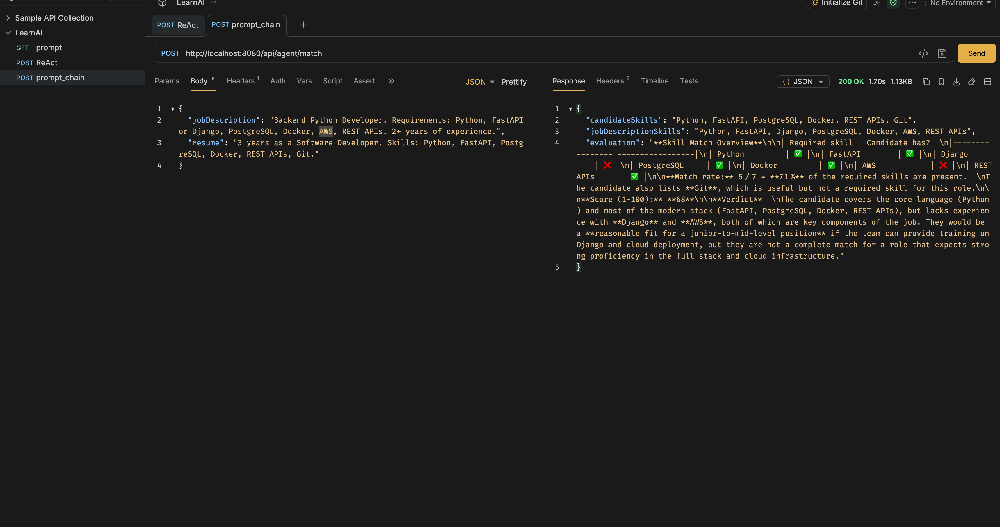

In This project I have implemented prompt chaining where I take response of one prompt and pass 
it to other prompt to solve the purpose of my application.
- In one prompt, I am extracting job description and then passing it to another prompt along with the skill extracted from a résumé in a separate prompt.  
The final result is the score of the résumé based on the job description provided.

prerequisites:
- Java 25
- GROQ apikey generated from https://console.groq.com/ and added to environment variable

Steps to run:
- Import the pom.xml
- mvn clean install
- start the PromptChainApplication
- Hit prom postman/Bruno a post call http://localhost:8080/api/agent/match with
POST /api/groq/match
  Content-Type: application/json

{
"jobDescription": "Backend Python Developer. Requirements: Python, FastAPI or Django, PostgreSQL, Docker, AWS, REST APIs, 2+ years of experience.",
"resume": "3 years as a Software Developer. Skills: Python, FastAPI, MySQL, Docker, REST APIs, Git."
}

Groq Models:
- You can find the groq model accessible to you on your groq logged-in portal

This is the way to call it 

POST /api/groq/match
Content-Type: application/json

{
"jobDescription": "Backend Python Developer. Requirements: Python, FastAPI or Django, PostgreSQL, Docker, AWS, REST APIs, 2+ years of experience.",
"resume": "3 years as a Software Developer. Skills: Python, FastAPI, MySQL, Docker, REST APIs, Git."
}

